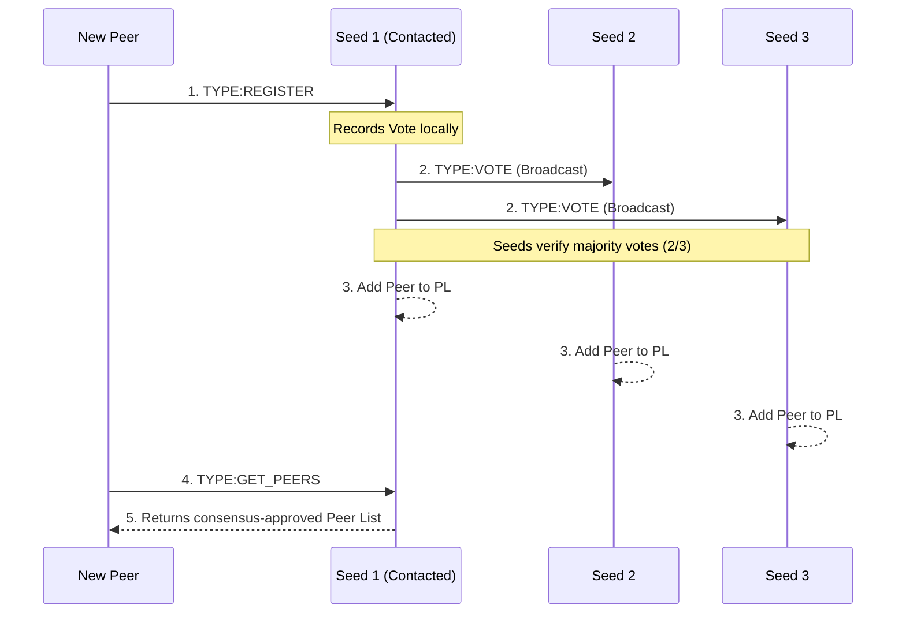
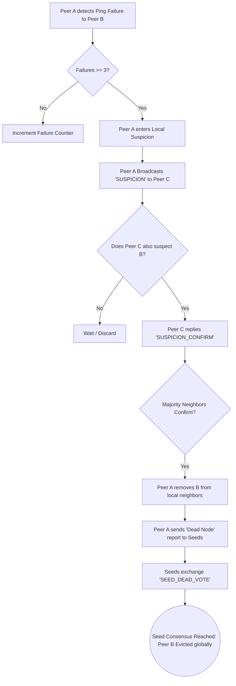

# Gossip-Based P2P Network with Multi-Level Consensus

## 📖 Overview
This project implements a distributed, fault-tolerant peer-to-peer (P2P) network built entirely in C++ using Winsock2. It supports reliable message dissemination, robust liveness detection, and consensus-driven membership management. 

The architecture actively prevents unilateral or malicious network alterations. It strictly requires multi-level agreement among peers and seed nodes before admitting a new node or evicting an unresponsive one from the overlay network.

---

## 🚀 Core Features & Algorithms

* **Barabási–Albert Power-Law Topology:** The overlay network is dynamically constructed using preferential attachment. Peers query the network for node degrees and use weighted probability (`std::discrete_distribution`) to select neighbors, naturally forming "hub" nodes for efficient gossip propagation.
* **Pure C++ SHA-256 Deduplication:** Gossip messages are cryptographically hashed upon receipt. The hashes are stored in a thread-safe Message List (ML) to drop duplicates and prevent infinite network loops.
* **Two-Level Fault Tolerance:** 
  1. *Peer-Level:* TCP socket checks monitor neighbor liveness. Failures trigger a local suspicion phase requiring neighbor cross-verification.
  2. *Seed-Level:* Confirmed dead-node reports from peers trigger a seed-level voting phase to safely evict the node globally.
* **Multithreaded Asynchronous I/O:** Utilizes C++ `std::thread` and `std::mutex` to handle concurrent socket connections, vote tracking, and gossip dissemination without blocking the main execution loops.

---

## 📊 System Architecture & Flowcharts

### 1. Peer Registration Consensus Flow
A node is only admitted to the network when a majority (⌊n/2⌋+1) of seed nodes agree on its inclusion.



### 2. Liveness Detection & Dead-Node Eviction Flow
Nodes are not removed based on a single failure. The system mitigates false suspicions through cross-verification.



---

## 📁 File Structure

| File | Description |
|------|-------------|
| `peer.cpp` | The multithreaded peer client/server. Handles power-law topology, gossip, and peer-level consensus. |
| `seed.cpp` | The seed node server. Manages the global Peer List (PL) and seed-level majority consensus voting. |
| `common.cpp` / `.h` | Shared low-level networking utilities (Winsock2 initialization, JSON-style serialization, SHA-256). |
| `run_all.py` | Python automation script to compile the C++ binaries, deploy the network, and simulate node deaths. |
| `config.txt` | Configuration file storing the IP address and port pairs of the designated seed nodes. |
| `outputfile.txt` | The consolidated execution log of the network, with entries prefixed by node identifiers. |

---

## 🛠️ Compilation & Execution

### Prerequisites
* Windows OS
* MinGW-w64 (g++) compiler with C++17 support.
* Python 3.x (Optional, for the automation script).

### Option A: Automated Testing (Recommended)
You can compile and run the entire network using the provided Python harness.

1. Open a terminal in the project directory.
2. Run the script:
   ```bash
   python run_all.py
   ```
3. The script will compile the .cpp files, start 6 processes (3 seeds, 3 peers), and provide an interactive prompt.
4. Type `kill <port>` in the python prompt to instantly simulate a node failure and watch the consensus algorithms trigger in the output.

### Option B: Manual Compilation
If you prefer to compile and run manually via the command line:

1. **Compile the Source Code:**
   ```bash
   g++ seed.cpp common.cpp -lws2_32 -std=c++17 -static-libgcc -static-libstdc++ -Wl,-Bstatic -lpthread -Wl,-Bdynamic -o seed.exe

   g++ peer.cpp common.cpp -lws2_32 -std=c++17 -static-libgcc -static-libstdc++ -Wl,-Bstatic -lpthread -Wl,-Bdynamic -o peer.exe
   ```

2. **Start Seed Nodes (Open 3 Terminals):**
   ```bash
   .\seed.exe 127.0.0.1 5001
   .\seed.exe 127.0.0.1 5002
   .\seed.exe 127.0.0.1 5003
   ```

3. **Start Peer Nodes (Open 3 Terminals):**
   ```bash
   .\peer.exe 127.0.0.1 6001
   .\peer.exe 127.0.0.1 6002
   .\peer.exe 127.0.0.1 6003
   ```

---

## ✉️ Protocol Formats

**Gossip Message:** Strictly adheres to `<self.timestamp>:<self.IP>:<self.Msg#>`.
- Example: `1734567890:127.0.0.1:6001:5` (Port included for localhost differentiation).

**Dead Node Report:** Strictly adheres to `Dead Node:<DeadNode.IP>:<DeadNode.Port>:<self.timestamp>:<self.IP>`.
- Example: `Dead Node:127.0.0.1:6001:1734567890:127.0.0.1`.

---

## 🛡️ Security Analysis & Attack Mitigation

### 1. False Suspicion Mitigation
**Vulnerability:** A peer experiences a localized network partition (e.g., a dropped packet) and falsely assumes a healthy neighbor is dead, attempting to unilaterally remove it from the network.

**Mitigation:** Implemented Peer-Level Consensus. When a node misses a TCP connection check, it is only flagged for "Local Suspicion." The reporting node must query the suspect's other neighbors. A Dead Node report is only generated and broadcast to the seeds if a strict majority (⌊n/2⌋ + 1) of the suspect's active neighbors cross-verify the failure.

### 2. Malicious Collusion & Sybil Attack Prevention
**Vulnerability:** A group of malicious peers collude to forge a Dead Node report against a legitimate user, or spam bogus registration requests to flood the network.

**Mitigation:** Implemented Seed-Level Consensus. Registration requests mandate connecting to a randomized subset of exactly ⌊n/2⌋+1 seeds. Furthermore, seeds do not implicitly trust Dead Node reports from peers. Upon receiving a report, seeds exchange SEED_DEAD_VOTE payloads. A peer is exclusively added to or purged from the network's global Peer Lists if a majority of independent seed nodes compute a definitive quorum, neutralizing unilateral disruption attempts.
